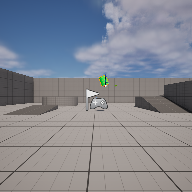

# Project Name  Summer24

## Description

A github repository for the in class demonstration code.   
 
## Usage
Clone, or download the zip, to a local directory. Open in Unreal Engine 5.4 or newer

## Attributions
1) Crystal Cave (song18), CynicMusic at OpenGameArt.org, Background music, ( https://opengameart.org/content/crystal-cave-song18 )
2) Time lapse of river, Image, Adi K, on Pexels ,( https://www.pexels.com/photo/time-lapse-of-river-582590/ )
3) characters animations implemented with Mixamo ( https://mixamo.com )
4) some character creation with MakeHuman, ( http://www.makehumancommunity.org )
5) Water melons, UE Market Place, ( https://www.unrealengine.com/marketplace/en-US/product/fantastic-village-pack )
6) Fox, Animal Variety packUE Market Place, ( https://www.unrealengine.com/marketplace/en-US/product/17c2d7d545674204a7644c3c0c4c58ba )
7) Magic from "NES Sounds" by Basto, OpenGameArt, ( https://opengameart.org/content/nes-sounds )

