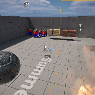

# Project Name  Summer24

## Description

A github repository for the in class demonstration code.   
 
## Usage
Clone, or download the zip, to a local directory. Open in Unreal Engine 5.4 or newer

## Attributions
1) Crystal Cave (song18), CynicMusic at OpenGameArt.org, Background music, ( https://opengameart.org/content/crystal-cave-song18 )
